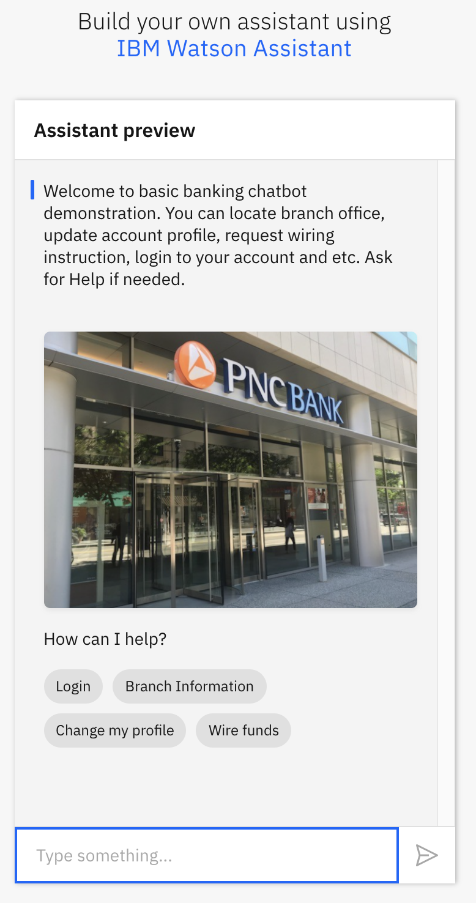
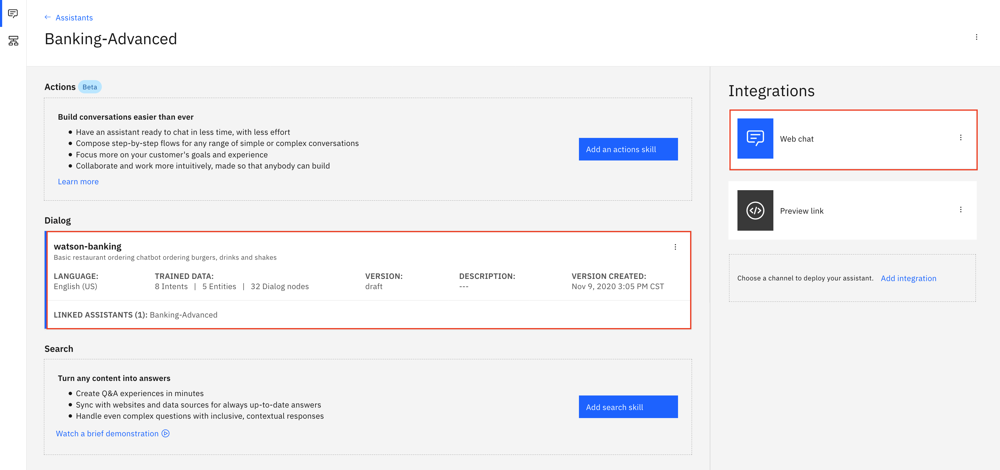
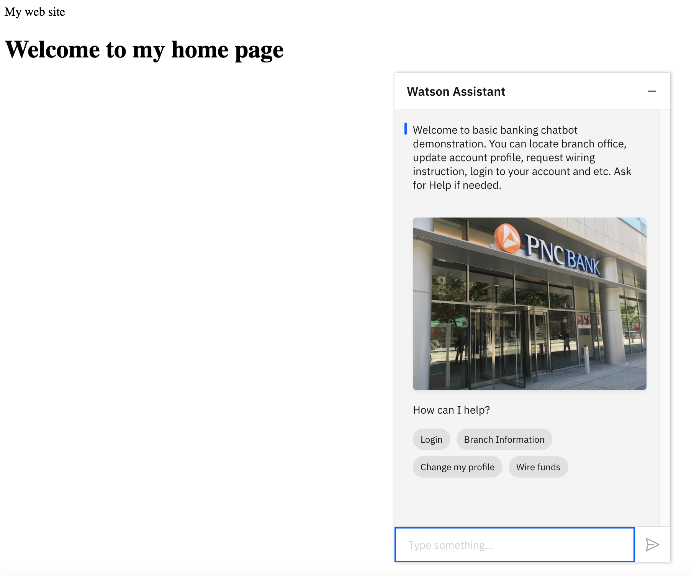
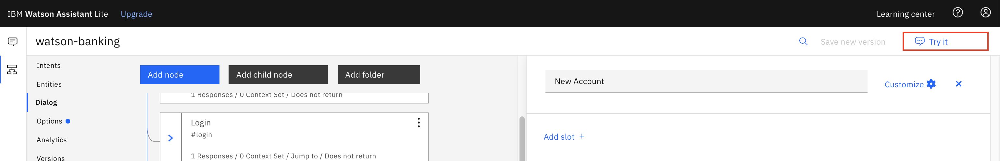
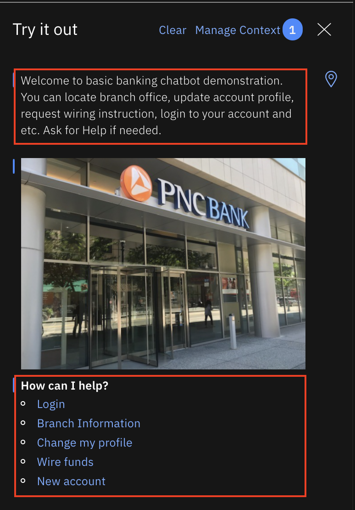
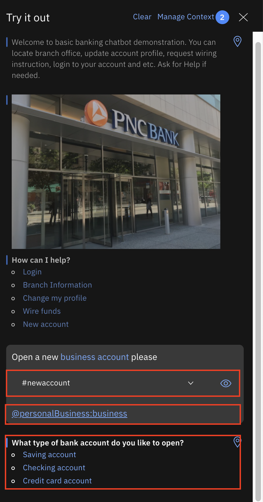

# Advanced Banking Chatbot with Watson Assistant Service

In this repo, you are going to use the advanced Watson Assistant features to build a dressed-up chatbot for typical banking use cases. 



Instead of a text-based chatbot, you build an app-like chatbot without the need to build an app. Buttons, dropdown list and etc are used to minimize end users's typing. When buttons are clicked or the option is chosen from the dropdown list, pre-configurerd text is entered on the end users' behalf.

Watson Natural Language Understanding(NLU) capabilities embeded in Watson Assistant service help you effectively understand what your customer want to do, such as finding branch office information, open new account and so on.

You can have a dressed-up chatbot up and running in no time. When you access the chatbot on a mobile device, the built-in voice input also supports verbal data entry which can greatly enhance the user experience.


After you complete the exercise, you will understand how to:

* Build Watson Assistant components
    - Intents
    - Entities
    - Dialog
* Via this dressed-up chatbot, you can have an app-like "application" run in a browser without developing an app.

This repo is part of Watson chatbot serial. The entire serial includes
* [Simple ChatBot](https://github.com/lee-zhg/watson-chatbot-simple.git)
* [Dressed-up ChatBot](https://github.com/lee-zhg/watson-chatbot-advanced.git)
* [Voice-Enabled ChatBot](https://github.com/lee-zhg/watson-voice-enabled-chatbot.git)
* [VoiceBot – Call and speak to ChatBot](https://github.com/lee-zhg/watson-voicebot.git) 

> **NOTE**: Watson Assistant service is available in IBM Cloud as well as part of IBM Cloud Pak for Data. As the result, you can deploy and run your chatbot in public cloud, private cloud, hybird cloud and on-prem.

> Click [here](https://www.ibm.com/products/cloud-pak-for-data) for more information about IBM Cloud Pak for Data.


## Use Case Flow

1. User sends messages to the application (running locally or on IBM Cloud).
2. The application sends the user message to IBM Watson Assistant service, and displays the ongoing chat in a web page.
3. Watson Assistant uses the NLU and NLP to understand and fulfill your order, and sends requests for additional information back to the running application. Watson Assistant can be provisioned on either IBM Cloud or IBM Cloud Pak for Data.


## Included Components

* [IBM Watson Assistant](https://www.ibm.com/cloud/watson-assistant/): Build, test and deploy a bot or virtual agent across mobile devices, messaging platforms, or even on a physical robot.


## Featured technologies

* [Node.js](https://nodejs.org/): An asynchronous event driven JavaScript runtime, designed to build scalable applications.


## Exercise Flow

### Step 1 - Clone or download  the repo

Instructions and Data files in repo https://github.com/lee-zhg/watson-chatbot-bank-advanced.git will be used to build chatbot during this exercise. The repo provides a small set of Assistant Intents, Entities, and Dialog Nodes.

#### Step 1.1 Download the repo

If you don't have `git CLI` available on your local machine, you may download repo `watson-chatbot-advanced` to your local machine. 

1. Go to repo https://github.com/lee-zhg/watson-chatbot-bank-advanced.git in a browser.

1. Select `Code` and then `Download ZIP`.

    

1. Unzip the zip file and take a note of the unzip folder.

#### Step 1.2 Clone the repo

If you have `git CLI` available on your local machine, you may clone repo `watson-chatbot-advanced` locally. 

1. Start a terminal.

1. Execute the command below.

    ```
    $ git clone https://github.com/lee-zhg/watson-chatbot-bank-advanced.git

    $ cd watson-chatbot-bank-advanced
    ```

1. Take a note of the clone folder.


### Step 2 - Create Watson Assistant service in IBM Cloud

Create a `Watson Assistant` service instance in IBM Cloud name it `banking-asssistant-service`:

* [**Watson Assistant**](https://cloud.ibm.com/catalog/services/conversation)


### Step 3 - Configure Watson Assistant

Import a `skill` definition that is used by the dressed-up chatbot,

1. Login to [IBM Cloud](https://cloud.ibm.com).

1. On the dashboard, find and open your `Watson Assistant` service instance.

1. Click `Launch Watson Assistant` on the `Manage` tab.

1. Select the `Skills` tab in the left navigation tab.

1. Click `Create skill`.

1. Select the `Dialog skill` option and then click `Next`.

1. Go to the `Import skill` tab.

1. Click the link `Drag and drop file here or click to select a file`.

1. Go to your cloned repo dir, and `Open` file [`data/skill-watson-burger.json`](data/skill-watson-banking.json).

1. Click `Import`.


### Step 4 - Creating an Assistant

The `assistant` is a fully hosted chatbot that is managed by IBM Cloud. It frees you from worrying about deploying and maintaining infrastructure to support the bot. It prrovides an alternative to host a chatbot without any programming.

An assistant is a cognitive bot that you can customize for your business needs, and deploy across multiple channels to bring help to your customers where and when they need it. Skills An assistant routes your customer queries to a skill, which then provides the appropriate response. 

#### Step 4.1 - Dialog skill

A `dialog skill` can understand and address questions or requests that your customers typically need help with. You provide information about the subjects or tasks your users ask about, and how they ask about them, and the product dynamically builds a machine learning model that is tailored to understand the same and similar user requests.

A sample burger-ordering `dialog skill` was imported to your `Watson Assistant` service instance when you deployed and run the sample application locally.

#### Step 4.2 - Search skill

A search skill leverages information from existing corporate knowledge bases or other collections of content authored by subject matter experts to address unanticipated or more nuanced customer inquiries.

>Note: Search skill is available to Plus or Premiums plan only.

#### Step 4.3 - Creating an Assistant

To create an `assistant`,

1. Login to [IBM Cloud](https://cloud.ibm.com).

1. On the dashboard, find and open your `Watson Assistant` service instance.

1. Click `Launch Watson Assistant` on the `Manage` tab.

1. Select the `Assistants` tab in the left navigation tab.

1. Click `Create assistant`.

1. Enter a name, for example `Banking-Advanced`.

1. Make sure that the `Enable preview link` and `Enable web chat` checkboxs are selected.

1. Click `Create assistant`.

1. Select `Add dialog skill`.

1. Select `watson-banking` skill.

    

1. Click `Preview link`.

    

1. Click the link under the section `Try it out and share the link` to show the chatbot on a sample web site.

    

1. The difference between text-based chatbot and dressed-up one is obvious. It is more exciting and extractive. Plus, it helps minimize end users' typing.


#### Step 4.4 - Test Drive

A dressed-up chatbot provides option to reduce end users' typing during the conversation. With a few clicks, the chatbot will guide you to complete your inquiry and receive desired information. 

However, if you like to bypass the pre-built flow and go straight to your point, you can still type your question. If your inquiry includes all required information to provide an answer, the chatbot will provide the feedback without any prompting.

In this section, you test the `Branch office` feature of the chatbot. The bot collects zipcode and displays the branch office(s) in the area. 

> **Note**: It's up to your application to render advanced Watson Assistant features. If your application does not support the advanced Watson Assistant features, you may not see buttons or dropdown list on the chatbot UI.

##### Step 4.4.1 - Test #1
1. Click `Branch Information` button. The chatbot types in `Branch Information` for you.

1. The chatbot replies

    ```
    Please enter the zipcode where the branch office locates.

    Please select zipcode
    15202
    15209
    ```

1. Select the `15202`.

1. Now, the chatbot has all required information and provides feedback. 

    ```
    Bank branch in zipcode 15202:

    470 Lincoln Ave, Pittsburgh, PA 15202
    (412) 766-1770

    Office Hour:
    Monday - Friday, 9am - 5pm
    Saturday, 9am - 1pm
    Sunday, closed
    ```

    >**Note**: The chatbot can display the message in larger font. It's possible to use HTML tags to format the messages. This can be done by directly editing JSON obejcts. However, it's up to your application to render the HTML tags properly.

1. A picture of the branch office is also available for visdual reference.

##### Step 4.4.2 - Test #2

1. If you prefer to provide all required information when making an inquiry, you can type a complete sentence. For example, `bank office in zipcode 15209`.

1. The chatbot parses the sentence and extracts useful information. It undserstands your `intent` is `branchinfo`, and also identifies and collects `zipcode` information. 

1. The chatbot recognizes that it has all required information. So, it completes the comversation by displaying a message.

    ```
    Bank branch in zipcode 15209:

    400 Grant Ave, Pittsburgh, PA 15209
    (412) 821-6600

    Office Hour:
    Monday - Friday, 9am - 5pm
    Saturday, 9am - 1pm
    Sunday, closed
    ```

##### Step 4.4.3 - Test #3

In a real world scenrio, the chatbot should retrieve branch office information from a database or API to a backend service, and dynamically populate the branch office list. To focus on the key chatbot features, the chatbot is configured to cover two zipcode 15202 and 15209. When you inquire branch office information for other zipcode, you'll be informed that the bot has not been trained to answer your inquiry.

1. Enter `bank office in zipcode 15200`.

1. The chatbot parses the sentence and extracts useful information. It recognizes that it has all required information. So, it travel down the pre-configured dialog flow and eventuall find out that it has been trained to complete the task. 

    ```
    The chatbot is only trained to help locate branch information for zipcode 15202 and 15209. You entered zipcode 15200. Please try again.
    ```

### Step 5 - Access the Chatbot from Existing Web Site

Add your assistant to your company website as a web chat widget that can help your customers with common questions and tasks, and can transfer customers to human agents.

When you create a web chat integration, code is generated that calls a script that is written in JavaScript. The script instantiates a unique instance of your assistant. You can then copy and paste the HTML script element into any page or pages on your website where you want users to be able to ask your assistant for help.

>Note: This integration is available to Plus or Premium plan users only in the past.

1. Login to [IBM Cloud](https://cloud.ibm.com).

1. On the dashboard, find and open your `Watson Assistant` service instance.

1. Click `Launch Watson Assistant` on the `Manage` tab.

1. Select the `Assistants` tab in the left navigation tab.

1. Select `Banking-Advanced`.

    

1. Click `Web chat` link.

1. Navigate to `Embed` tab.

    

1. When you create a web chat integration, code is generated that calls a script that is written in JavaScript. The script instantiates a unique instance of your assistant. You can then copy and paste the HTML script element into any page or pages on your website where you want users to be able to ask your assistant for help.

1. Copy the script.

1. Open file `sample_homepage.html` in a file editor. The file locates in the root folder of the downloaded repo. This sample HTML file is used to simulate a company web page.

1. Past the script under the section `<!-- copied script elements -->`. 

    ```
    <html>
    <head>My web site</head>
        <body>
            <title>My Test Page</title>
            <H1>Welcome to my home page</H1> 
            <!-- <p>Welcome to my home page</p> -->
            
            <!-- copied script elements -->
            <script>
                window.watsonAssistantChatOptions = {
                    integrationID: "fdb87f4a-9dcc-4cbd-bd2f-aa383a2b3994", // The ID of this integration.
                    region: "us-south", // The region your integration is hosted in.
                    serviceInstanceID: "c905ff27-4a9a-44ca-8610-607094de1ab7", // The ID of your service instance.
                    onLoad: function(instance) { instance.render(); }
                };
                setTimeout(function(){
                const t=document.createElement('script');
                t.src="https://web-chat.global.assistant.watson.appdomain.cloud/loadWatsonAssistantChat.js";
                document.head.appendChild(t);
                });
            </script>        

        </body>
    </html>

    ```

1. Save the changes.

1. Open the file `sample_homepage.html` in a browser.

1. The chatbot widget is embeded at the bottom-right corner of the web page.

    

1. The chatbot widget is expanded when you click on it. The chatbot window appears on the web page.

    


### Step 6 - Modifying Dialog Skills

In this section, you are going to add `New account` service to the chatbot. This use case should help better understand how the chatbot works.

The natural-language processing for the Watson Assistant service is defined in a dialog skill, which is a container for all of the artifacts that define a conversation flow.

#### Step 6.1 - Use Case

To add the `New account` service, you'll need to create a new intent `newaccount`. The new `intent` identifies the end users' intention to trigger the new `New account` service.

For the discussion of the use case, let's assume that two pieces of information must be collected before a new account can be created.
- personal vs business account 
- account type: saving account, checking accoiunt or credit card account

To collect these two information, you are going to create two `entities`.
- personalBusiness
- accountType

Then, a new node will be added to the Skill Dialog. It controls the flow of new service.

Before the new service goes alive, the Watson Assistant will re-train the chatbot after the new `intent`, `entities` and `Dialog` are created. After that, the chatbot will be able to identify the new `intent`, and understand how to identify and collect the new `entities`, and guide end users through the conversation. 

#### Step 6.2 - Intents

Intents are purposes or goals that are expressed in a customer's input, such as answering a question or processing a bill payment. By recognizing the intent expressed in a customer's input, the Watson Assistant service can choose the correct dialog flow for responding to it.

##### Step 6.2.1 - Plan the intents for your application.

Consider what your customers might want to do, and what you want your application to be able to handle on their behalf. For example, you might want your application to help your customers make a purchase. If so, you can add a #buy_something intent. (The # that is added as a prefix to the intent name helps to clearly identify it as an intent.)

##### Step 6.2.2 - Teach Watson about your intents.

After you decide which business requests that you want your application to handle for your customers, you must teach Watson about them. For each business goal (such as #buy_something), you must provide at least 5 examples of utterances that your customers typically use to indicate their goal. For example, I want to make a purchase.

Ideally, find real-world user utterance examples that you can extract from existing business processes. The user examples should be tailored to your specific business. For example, if you are an insurance company, a user example might look more like this, I want to buy a new XYZ insurance plan.

The examples that you provide are used by your assistant to build a machine learning model that can recognize the same and similar types of utterances and map them to the appropriate intent.

`intent` is verb in a natural language analogy.

##### Step 6.2.3 - Creating #newaccount intent and adding its utterance

To add utterance to `#newaccount` intent,

1. Login to [IBM Cloud](https://cloud.ibm.com).

1. On the dashboard, find and open your `Watson Assistant` service instance.

1. Click `Launch Watson Assistant` on the `Manage` tab.

1. Select the `Skills` tab in the left navigation tab.

1. Select `watson-banking` tile.

1. `Intents` is selected by default.

1. Select `Create intent +` button.

1. Enter `newaccount` as the `Intent name`.

    > Note: Prefix `#` is added. All intents are prefixed by `#`.

1. Click `Create intent` button to create the `newaccount` intent.

1. Then, you must add at least five user examples to help Watson understand the new `intent`.

    - Enter `I like to open a new credit card account` in the `User example` field.
    - Click `Add example` button.
    - Repeat the same steps to add a few more examples.
        * `new business account`
        * `new personal account`
        * `open a checking account`
        * `open a new account`
        * `open a saving account`
    - Feel free to add additional examples of your choice

1. Your new `intent` should look like this.

   

`watson-banking` was developed as a skill to handle typical banking tasks. Except the typical house-keeping intents, such as `#exit`, `#help` and `#reset`, other intents include `#branchinfo`, `#changeprofile`, `#login` and `#wirefund`.

You can add as many utterance examples for each `intent` as you like, but minimal 5 examples. The objective of the `newaccount` intent is to identify the attempt to trigger the new account service. The utterance examples are provided to meet the objective.

You may redesign the `intent` if you like to implement it differently.


#### Step 6.3 - Entities

Entities represent information in the user input that is relevant to the user's purpose.

If intents represent verbs (the action a user wants to do), entities represent nouns (the object of, or the context for, that action). For example, when the intent is to get a weather forecast, the relevant location and date entities are required before the application can return an accurate forecast.

Recognizing entities in the user's input helps you to craft more useful, targeted responses. For example, you might have a #buy_something intent. When a user makes a request that triggers the #buy_something intent, the assistant's response should reflect an understanding of what the something is that the customer wants to buy. You can add a @product entity, and then use it to extract information from the user input about the product that the customer is interested in. (The @ prepended to the entity name helps to clearly identify it as an entity.)

You can add multiple responses to your dialog tree with wording that differs based on the @product value that is detected in the user's request.

`entity` is noun in a natural language analogy.

##### Step 6.3.1 - Dictionary-based method

Your assistant looks for terms in the user input that match the values, synonyms, or patterns you define for the entity.

* Synonym entity: You define a category of terms as an entity (color), and then one or more values in that category (blue). For each value you specify a bunch of synonyms (aqua, navy). You can also pick synonyms to add from recommendations made to you by Watson.

    At run time, your assistant recognizes terms in the user input that exactly match the values or synonyms that you defined for the entity as mentions of that entity.

* Pattern entity: You define a category of terms as an entity (contact_info), and then one or more values in that category (email). For each value, you specify a regular expression that defines the textual pattern of mentions of that value type. For an email entity value, you might want to specify a regular expression that defines a text@text.com pattern.

    At run time, your assistant looks for patterns matching your regular expression in the user input, and identifies any matches as mentions of that entity.

* System entity: Synonym entities that are prebuilt for you by IBM. They cover commonly used categories, such as numbers, dates, and times. You simply enable a system entity to start using it.

##### Step 6.3.2 - Annotation-based method

When you define an annotation-based entity, which is also referred to as a contextual entity, a model is trained on both the annotated term and the context in which the term is used in the sentence you annotate. This new contextual entity model enables your assistant to calculate a confidence score that identifies how likely a word or phrase is to be an instance of an entity, based on how it is used in the user input.

* Contextual entity: First, you define a category of terms as an entity (product). Next, you go to the Intents page and mine your existing intent user examples to find any mentions of the entity, and label them as such. For example, you might go to the #buy_something intent, and find a user example that says, I want to buy a Coach bag. You can label Coach bag as a mention of the @product entity.

    For training purposes, the term you annotated, Coach bag, is added as a value of the @product entity.

    At run time, your assistant evaluates terms based on the context in which they are used in the sentence only. If the structure of a user request that mentions the term matches the structure of an intent user example in which a mention is labeled, then your assistant interprets the term to be a mention of that entity type. For example, the user input might include the utterance, I want to buy a Gucci bag. Due to the similarity of the structure of this sentence to the user example that you annotated (I want to buy a Coach bag), your assistant recognizes Gucci bag as a @product entity mention.

    When a contextual entity model is used for an entity, your assistant does not look for exact text or pattern matches for the entity in the user input, but focuses instead on the context of the sentence in which the entity is mentioned.

    If you choose to define entity values by using annotations, add at least 10 annotations per entity to give the contextual entity model enough data to be reliable.

##### Step 6.3.3 - Creating Entity

You create two entities for the `new account` service in this section. They help identify two kind of account types.
- personal vs business
- saving, checking and credit card account

###### Step 6.3.3.1 - Creating entity `@personalBusiness`

To modify entity `@personalBusiness`,

1. Login to [IBM Cloud](https://cloud.ibm.com).

1. On the dashboard, find and open your `Watson Assistant` service instance.

1. Click `Launch Watson Assistant` on the `Manage` tab.

1. Select the `Skills` tab in the left navigation tab.

1. Select `watson-banking` tile.

1. Select `Entities` in the left navigation pane.

1. Select `Create entity` button.

1. Enter `personalBusiness` in the `Entity name` field.

    > Note: Prefix `@` is added to all entities.

1. Click `Create entity` button.

1. Enter `business` in the `Value` field.

1. Enter `business account` in the `Synonyms` field.

1. Optionally, you can add additional synonyms.

1. Click `Add value` button.

1. Enter `personal` in the `Value` field.

1. Enter `personal account` in the `Synonyms` field.

   

1. Click `Add value`.

###### Step 6.3.3.2 - Creating entity `@accountType`

To modify entity `@accountType`,

1. Login to [IBM Cloud](https://cloud.ibm.com).

1. On the dashboard, find and open your `Watson Assistant` service instance.

1. Click `Launch Watson Assistant` on the `Manage` tab.

1. Select the `Skills` tab in the left navigation tab.

1. Select `watson-banking` tile.

1. Select `Entities` in the left navigation pane.

1. Select `Create entity` button.

1. Enter `accountType` in the `Entity name` field.

    > Note: Prefix `@` is added to all entities.

1. Click `Create entity` button.

1. Enter `checking account` in the `Value` field.

1. Enter `checking` in the `Synonyms` field.

1. Optionally, you can add additional synonyms.

1. Click `Add value` button.

1. Enter `saving account` in the `Value` field.

1. Enter `saving` in the `Synonyms` field.

1. Click `Add value` button.

1. Enter `credit card account` in the `Value` field.

1. Enter `credit card` in the `Synonyms` field.

   

1. Click `Add value`.


#### Step 6.4 - Dialog

The dialog uses the intents that are identified in the user's input, plus context from the application, to interact with the user and ultimately provide a useful response.

The dialog matches intents (what users say) to responses (what the bot says back). The response might be the answer to a question such as Where can I get some gas? or the execution of a command, such as turning on the radio. The intent and entity might be enough information to identify the correct response, or the dialog might ask the user for more input that is needed to respond correctly. For example, if a user asks, Where can I get some food? you might want to clarify whether they want a restaurant or a grocery store, to dine in or take out, and so on. You can ask for more details in a text response and create one or more child nodes to process the new input.

The dialog is represented graphically in Watson Assistant as a tree. Create a branch to process each intent that you want your conversation to handle. A branch is composed of multiple nodes.

##### Step 6.4.1 - Dialog nodes

Each dialog node contains, at a minimum, a condition and a response.

* Condition: Specifies the information that must be present in the user input for this node in the dialog to be triggered. The information is typically a specific intent. It might also be an entity type, an entity value, or a context variable value. See Conditions for more information.

* Response: The utterance that your assistant uses to respond to the user. The response can also be configured to show an image or a list of options, or to trigger programmatic actions. See Responses for more information.

You can think of the node as having an if/then construction: if this condition is true, then return this response.


##### Step 6.4.2 - Dialog flow

The dialog that you create is processed by your assistant from the first node in the tree to the last.

    

As it travels down the tree, if your assistant finds a condition that is met, it triggers that node. It then moves along the triggered node to check the user input against any child node conditions. As it checks the child nodes it moves again from the first child node to the last.

Your assistant continues to work its way through the dialog tree from first to last node, along each triggered node, then from first to last child node, and along each triggered child node until it reaches the last node in the branch it is following.

    

When you start to build the dialog, you must determine the branches to include, and where to place them. The order of the branches is important because nodes are evaluated from first to last. The first root node whose condition matches the input is used; any nodes that come later in the tree are not triggered.

When your assistant reaches the end of a branch, or cannot find a condition that evaluates to true from the current set of child nodes it is evaluating, it jumps back out to the base of the tree. And once again, your assistant processes the root nodes from first to the last. If none of the conditions evaluates to true, then the response from the last node in the tree, which typically has a special anything_else condition that always evaluates to true, is returned.

You can disrupt the standard first-to-last flow in the following ways:

* By customizing what happens after a node is processed. For example, you can configure a node to jump directly to another node after it is processed, even if the other node is positioned earlier in the tree. 

* By configuring conditional responses to jump to other nodes. 

* By configuring digression settings for dialog nodes. Digressions can also impact how users move through the nodes at run time. If you enable digressions away from most nodes and configure returns, users can jump from one node to another and back again more easily. 

##### Step 6.4.3 - Modifying Dialog Flow of Skill watson-banking

By now, you have basic understanding of `intent` and `entity`, and how `dialog` defines the chatbot flow. In this section, you modify the `dialog` to make the `new account` service available in the chatbot.

###### Step 6.4.3.1 - Modifying "Welcome" node of Skill watson-banking

In this section, you modify the `Welcome` node and make the `New account` task option available when the chatbot is initiated.

1. Login to [IBM Cloud](https://cloud.ibm.com).

1. On the dashboard, find and open your `Watson Assistant` service instance.

1. Click `Launch Watson Assistant` on the `Manage` tab.

1. Select the `Skills` tab in the left navigation tab.

1. Select `watson-burger` tile to open it.

1. Select `Dialog` in the left pane.

1. Click the `Welcome` node to open its property window.

1. Scroll down until you find the `Option` reponse type which has title `How can I help?`.

    

1. Click `Add option +` link.

1. Enter `New account` in both `Enter lab` and `Enter value` field.

1. Tab out both fields.

    

1. The `New account` task option is avialble when the chatbot restarts.


###### Step 6.4.3.2 - Adding "New Account" node to Skill watson-banking

In this section, you modify the `New Account` node. This node provides support to the conversation flow when `New account` intent is identified.

1. Select `3 dots` on the `Wiring Funds` node.

    

1. Select `Add node below` menu option from the pop-up menu.

1. Enter `New Account` in the top field of the new node property window.

    

1. Click the `Customize` link next to the `New Account` field.

1. Turn on the `Slot` feature.

    

1. Click `Apply` to close the `Customize "New Account"` window.

1. In the `If assistant recognizes` field, enter `#newaccount`. This sets the node condition to true only when `#newaccount` is the intent. In another word, you only come into this node when the intent is `#newaccount`.

1. When the slot is enabled for a node, a new section `Then check for` is added to the node properties window. You may configure slot(s) in this section. And the section has the `Customize slot` icon.

    

1. Click the `Customize slot` icon of new section to open the `Configure slot 1` window.

    

1. In the `Check for` field, enter `@personalBusiness`.

1. In the `Save it as` field, enter `$personalBusiness`.

    

1. In the `If slot context variable is not present ask:` section, click the dropdown list which is currently labeled as `Text`.

1. Select the `Option` menu option.

    

1. Expand the `If slot context variable is not present ask:` section by clicking the `down arraw` icon next to the trash can.

    

1. In the `Title` field, enter `Is this for personal or business?`.

    

1. Click `Add option +` link.

1. Enter `Personal` in both `Enter label` and `Enter value` fields.

1. Click `Add option +` link.

1. Enter `Business` in both `Enter label` and `Enter value` fields.

1. You have configured the first slot for the `New account` service. It checks if entity `@personalBusiness` is available. If end users have provided the information, it's stored in context variable `$personalBusiness`. Otherwise, the end users will be prompted to enter the information. The chatbot is also configured to provide two buttons of `Personal` and `Business` for the end users to choose.

    

1. Select `Save` to save the slot. You are back to the `New account` properties window.

    

1. Select `Add slot +` to add a new slot.

    

1. Click the `Customize slot` icon of the new slot to open the `Configure slot 2` window.

1. In the `Check for` field, enter `@accountType`.

1. In the `Save it as` field, enter `$accountType`.

1. In the `If slot context variable is not present ask:` section, click the dropdown list which is currently labeled as `Text`.

1. Select the `Option` menu option.

1. Expand the `If slot context variable is not present ask:` section by clicking the `down arraw` icon next to the trash can.

1. In the `Title` field, enter `What type of bank account do you like to open?`.

1. Click `Add option +` link.

1. Enter `Saving account` in both `Enter label` and `Enter value` fields.

1. Click `Add option +` link.

1. Enter `Checking account` in both `Enter label` and `Enter value` fields.

1. Click `Add option +` link.

1. Enter `Credit card account` in both `Enter label` and `Enter value` fields.

1. You have configured the second slot for the `New account` service. It checks if entity `@accountType` is available. If end users have provided the information, it's stored in context variable `$accountType`. Otherwise, the end users will be prompted to enter the information. The chatbot is also configured to provide three buttons of `Saving accont`, `Checking account` and `Credit card account` for the end users to choose.

    

1. Select `Save` to save the slot. You are back to the `New account` properties window.

    

1. In the `Assistant responds` section, enter `Thank you for banking with us. New $personalBusiness $accountType was opened` in the `Enter reponse text` field.

1. Tab out the field. A new `response variation` field is added on the screen.

    

1. The `response variation` displays alternative response from conversation to conversation. It's not required, but helps make the conversation more interesting. The sequence of response displaying can be set to `sequential` or `random`.

1. Enter `New $personalBusiness $accountType was opened. Do you need anything else?` in the `Enter response variation` field.

    

1. Optionally, you may add additional `response variation`.

1. Scroll down to the bottom of the `New Account` node properties window. The last section defines what the chatbot should do after the current node is processed. By default, it's set to `Wait for reply` option.

    There are three possible options. Depending on the circumstance, you may see two options.

    - Wait for user input: Your assistant pauses until new input is provided by the user.
    - Skip user input: Your assistant jumps directly to the first child node. This option is only available if the current node has at least one child node.
    - Jump to: Your assistant continues the dialog by processing the node you specify. You can choose whether your assistant should evaluate the target node's condition or skip directly to the target node's response. 

1. Click the dropdown menu and select `Jump to` option.

1. Select `Reset` node. 

    

1. Another pop-up window with three options appears.

1. Select `Respond` option.

    

1. This concludes the `New Account` node configuration.


#### Step 6.5 - Try it

So far, you have tested the chatbot via the `assistant` preview (a fully hosted chatbot that is managed by IBM Cloud). In this section, you test the chatbot via `Try it` link which is an integrated component of Watson Assistant development environment in IBM Cloud.

You may get slightly different UI display when you test the chatbot in differrent environment as the advanced Watson Assistant features can be rendered differently.

However, `Try it` provides a quick testing option while you develop a skill.



To test the chatbot via `try it` link,

1. Login to [IBM Cloud](https://cloud.ibm.com).

1. On the dashboard, find and open your `Watson Assistant` service instance.

1. Click `Launch Watson Assistant` on the `Manage` tab.

1. Select the `Skills` tab in the left navigation tab.

1. Select `watson-banking` tile to open it.

1. Click `Try it` link. The "Try it out` window open on the right. 

    

1. The chatbot displays the greeting and show a list of services. 

##### Step 6.5.1 - Test Case #1

1. Click `New account` task. The chatbot types in `New account` for you.

1. Then, the chatbot understands your `newaccount` intent and prompts for additional information required for openning new account. It collects `@personalBusiness` entity by prompting

    ```
    Is this for personal or business?
    * Personal
    * Business
    ```

1. You may choose to type information any time you like. However, the chatbot presents an alternative for easy data entry.

1. Select the `Personal` from the list.

1. Next, the chatbot collects information of `@accountType` entity.

    ```
    What type of bank account do you like to open?
    * Saving account
    * Checking account
    * Credit card account
    ```

1. Select `Saving account` option.

1. The chatbot has successfully collected two information required to open a new account. It displays message below to mark the end of the conversation.

    ```
    Thank you for banking with us. New personal saving account was opened.
    ```

    >**Note**: In the real world use case, the chatbot will pass the collected information to the back end service(s) to complete the `New account` transaction at this point. Integrating chatbot with other services/systems is not covered in this repo.

##### Step 6.5.2 - Test Case #2

1. If you prefer to provide all required information when talking to the chatbot, you can feel free to type a complete sentence. For example, `Open a new personal saving account please`.

1. The chatbot parses the sentence and extracts useful information. It recognizes that it has all required information. So, it completes the conversation by displaying a message.

    ```
    Thank you for banking with us. New personal saving account was opened.
    ```

    

1. The `New Account` node required both `@personalBusiness` and `@accountType`. Since you provided both required information when you make request, the chatbot grabs all required information and complete the conversation. 

1. The `intent` and `entity` information in the current context are available on the `Try it` UI. As the above screen shot shows, the chatbot identified
    * `#newaccount` as intent
    * entity `@personalBusiness` as `personal`. 
    * entity `@accountType` as `saving account`.

##### Step 6.5.3 - Test Case #3

1. You can also provide partial required information when talking to the chatbot. For example, `Open a new business account please`.

1. The chatbot parses the sentence and extracts useful information. It recognizes
    * `#newaccount` as intent
    * entity `@personalBusiness` as `personal`. 

    

1. Next, the chatbot collects information of `@accountType` entity.

    ```
    What type of bank account do you like to open?
    * Saving account
    * Checking account
    * Credit card account
    ```

1. Select `Checking account` option.

1. Now, the chatbot has has all required information to open a new account. It displays message below to mark the end of the conversation.

    ```
    Thank you for banking with us. New business checking account was opened.
    ```


## License

This code pattern is licensed under the Apache Software License, Version 2.  Separate third party code objects invoked within this code pattern are licensed by their respective providers pursuant to their own separate licenses. Contributions are subject to the [Developer Certificate of Origin, Version 1.1 (DCO)](https://developercertificate.org/) and the [Apache Software License, Version 2](https://www.apache.org/licenses/LICENSE-2.0.txt).

[Apache Software License (ASL) FAQ](https://www.apache.org/foundation/license-faq.html#WhatDoesItMEAN)

## Links

* [Demo on youtube](https://youtu.be/6QlAnqSiWvo)
* [IBM Watson Assistant Docs](https://cloud.ibm.com/docs/services/conversation/dialog-build.html#dialog-build)
* [Blog for IBM Watson Assistant Slots Code Pattern](https://developer.ibm.com/code/2017/09/19/managing-resources-efficiently-watson-conversation-slots/)

## Learn more

* **Artificial Intelligence Code Patterns**: Enjoyed this Code Pattern? Check out our other [AI Code Patterns](https://developer.ibm.com/technologies/artificial-intelligence/).
* **AI and Data Code Pattern Playlist**: Bookmark our [playlist](https://www.youtube.com/playlist?list=PLzUbsvIyrNfknNewObx5N7uGZ5FKH0Fde) with all of our Code Pattern videos
* **With Watson**: Want to take your Watson app to the next level? Looking to utilize Watson Brand assets? [Join the With Watson program](https://www.ibm.com/watson/with-watson/) to leverage exclusive brand, marketing, and tech resources to amplify and accelerate your Watson embedded commercial solution.
* **Kubernetes on IBM Cloud**: Deliver your apps with the combined the power of [Kubernetes and Docker on IBM Cloud](https://www.ibm.com/cloud/container-service)
